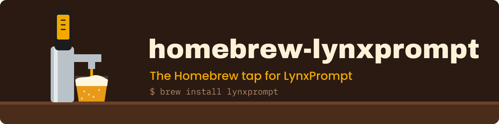

<p align="center"></p>

<h1 align="center">homebrew-lynxprompt</h1>

<p align="center">
  <a href="https://www.npmjs.com/package/lynxprompt"></a>
  <a href="LICENSE"></a>
</p>

Homebrew tap for the LynxPrompt CLI, which generates and syncs AI IDE configuration files (`AGENTS.md`, `CLAUDE.md`, `.cursor/rules/`) from a self-hostable platform.

## Quick start

```bash
brew tap GeiserX/lynxprompt
brew install lynxprompt
lynxprompt wizard
```

`brew upgrade lynxprompt` updates it. Commands and options: [CLI reference](https://lynxprompt.com/docs/cli).

## Related projects

[LynxPrompt](https://github.com/GeiserX/LynxPrompt), [lynxprompt-vscode](https://github.com/GeiserX/lynxprompt-vscode), [lynxprompt-action](https://github.com/GeiserX/lynxprompt-action), [lynxprompt-mcp](https://github.com/GeiserX/lynxprompt-mcp).

## License

[GPL-3.0-or-later](LICENSE)
